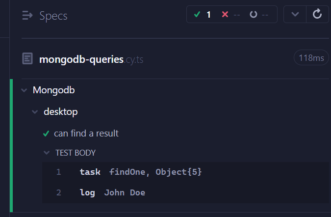

## INSTALL
yarn | npm install

## OPEN CYPRESS
yarn test | npm run test

## BEFORE EXECUTING THE TEST
You need to have mongodb up in your system:
1. Download and install MongoDB community server from https://www.mongodb.com/try/download/community
2. Create a new database and collection
   1. In the test I use "database" for the database name
   2. In the test I use "collection" for the collection name
3. Click on Add data -> Insert document
   1. Paste the following json: { "name": "John Doe", "age": 25 }
   2. Click on Insert button

You should see something like this in the MongoDB app:

## RUN THE TEST
After opening cypress:
1. Select E2E Testing
2. Select Chrome
3. Select Start E2E Testing in Chrome
4. Click on mongodb-queries

You will see the query result printed on the test

